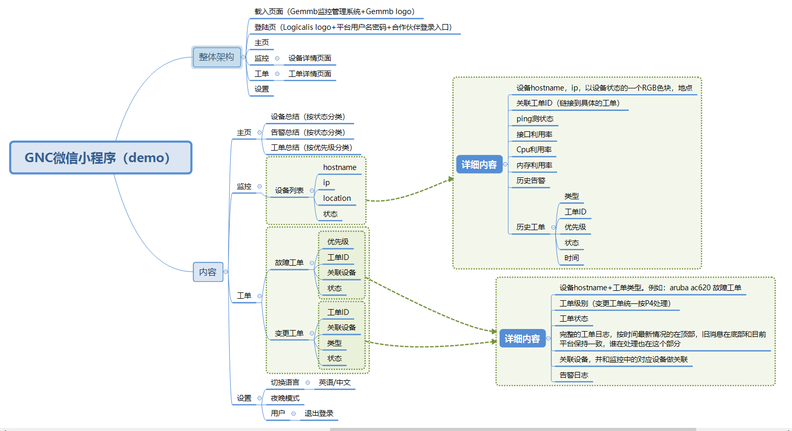

# 上线项目

**小程序搜索：Gemmb监控管理系统**

用户名：ZSCB@ZSCB      密码:Welcome01

# 在线地址

小程序的ui设计搞

https://xd.adobe.com/view/f54b3f93-2b7e-43a8-788e-e2cdfcc6080e-837a/

# 功能图

# 核心技术

- flyio
- mpvue
- vue-i18n
- Vuex
- vant-weapp

# 项目结构

-------build

-------config

-------src

​         --------api											封装整个项目的接口请求

​         --------assets									  字体图标

​         --------components						   通用组件

​         ---------il8n										双语言

​         ---------pages									页面组件

​        ----------store								    存储

​        ----------utils										工具

​        ----------App.vue								 组件入口				

​        ----------main.js.                      			全局js，注册全局组件      		

​        ----------app.json                         		微信小程序的入口         

-------static												图片 插件

# 开发总结

- 拆分
- 合并
- 重构

# 遇到的坑

- 插件少bug多基本上都要自己写
- 开发效率低，编译时间太久
- 开发工具有bug（微信开发者工具）
- 类似于vue多页面开发，但是vue里面很多功能mpvue用不了
- 兼容性问题至今还有部分没有解决
- 下拉刷新的功能，ios有兼容性问题（官方上也这么说）

